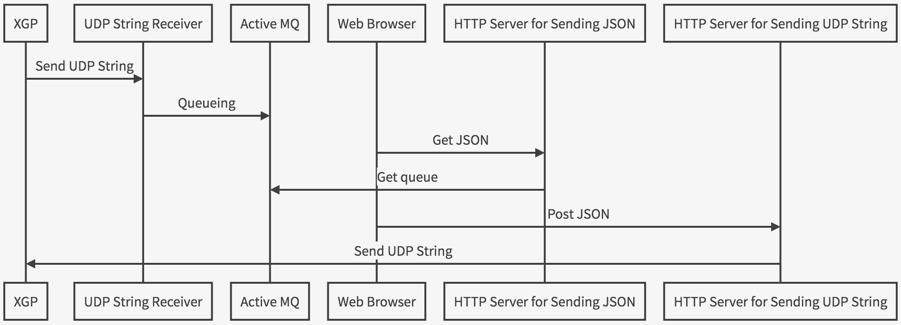

「XGP <-> ブラウザ」のためのツールセット
===

## 概要

[XGP](https://link.springer.com/article/10.1007/s10015-010-0857-9)から送られてくる[OSI参照モデル](https://qiita.com/tatsuya4150/items/474b60beed0c04d5d999)で言うところのL4なUDP StringをL7なHTTP JSONに変換し、その逆もしかりなツールセットです。

## シーケンス図



```sequence
XGP->UDP String Receiver: Send UDP String
UDP String Receiver->Active MQ: Queueing
Web Browser->HTTP Server for Sending JSON: Get JSON
HTTP Server for Sending JSON->Active MQ: Get queue
Web Browser->HTTP Server for Sending UDP String: Post JSON
HTTP Server for Sending UDP String->XGP: Send UDP String
```

## 使い方

黒い画面でやる

### Python 3.x が入っているか確認

```
$ python3 --version
```

### bash: python3: command not found と表示された場合

```
$ /usr/bin/ruby -e "$(curl -fsSL https://raw.githubusercontent.com/Homebrew/install/master/install)"
$ brew install python3
$ python3 --version
```

### このリポジトリをcloneする

```
$ git clone 

```